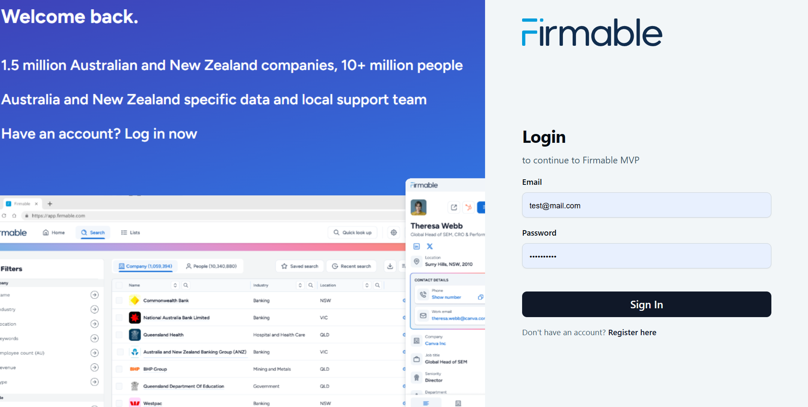
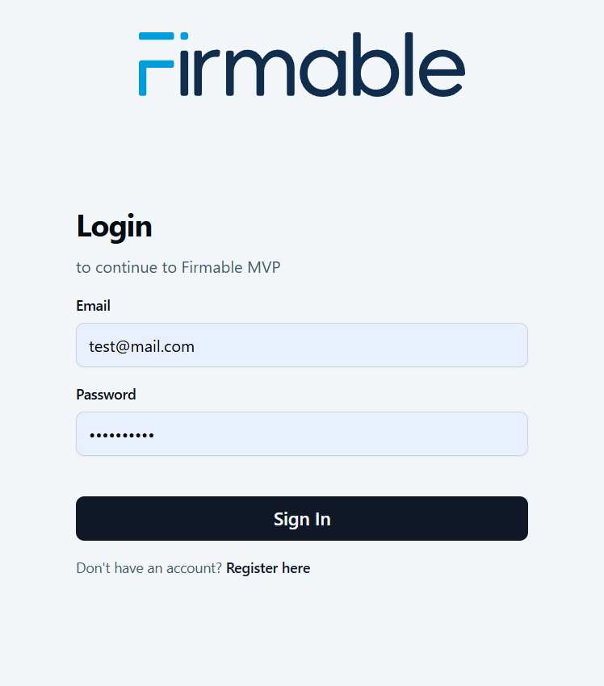
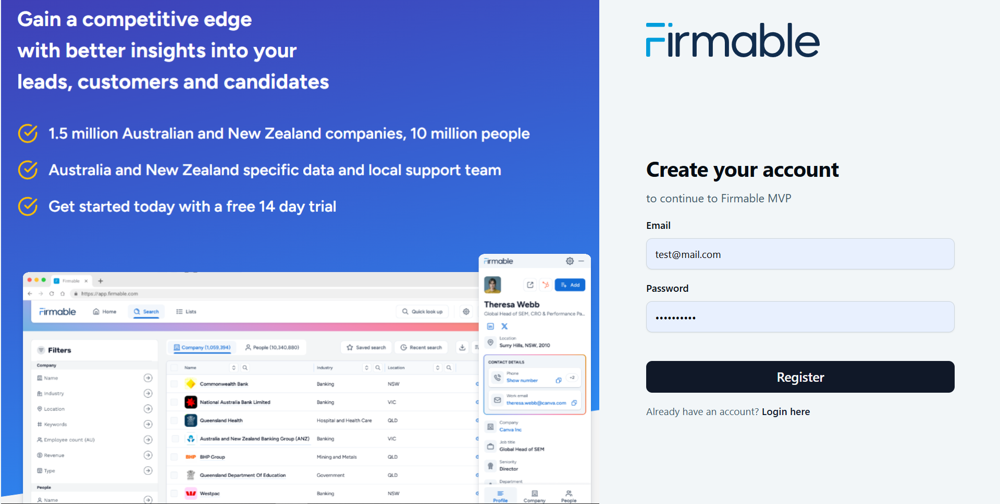
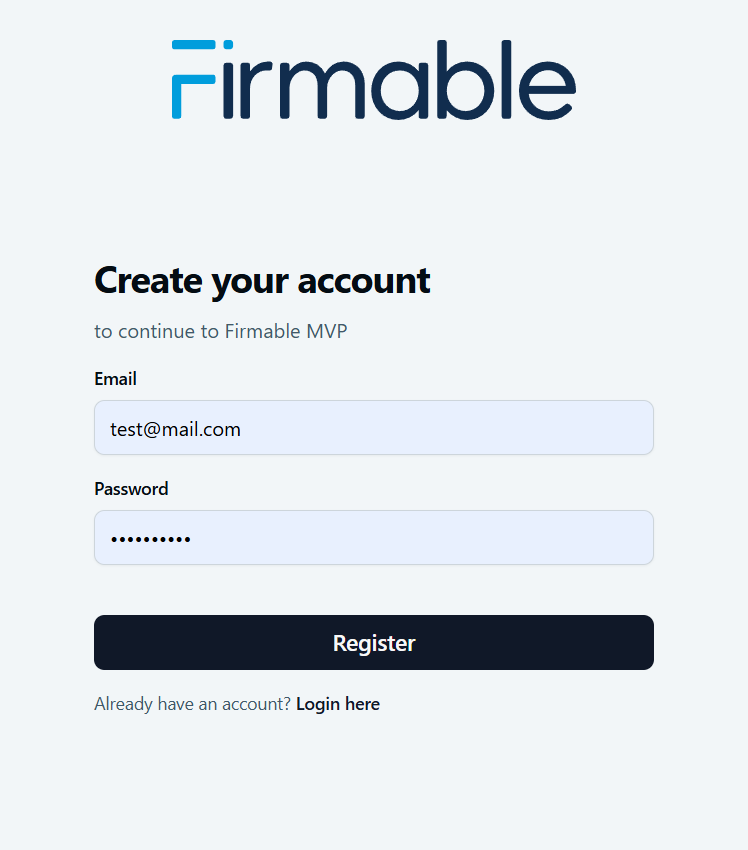
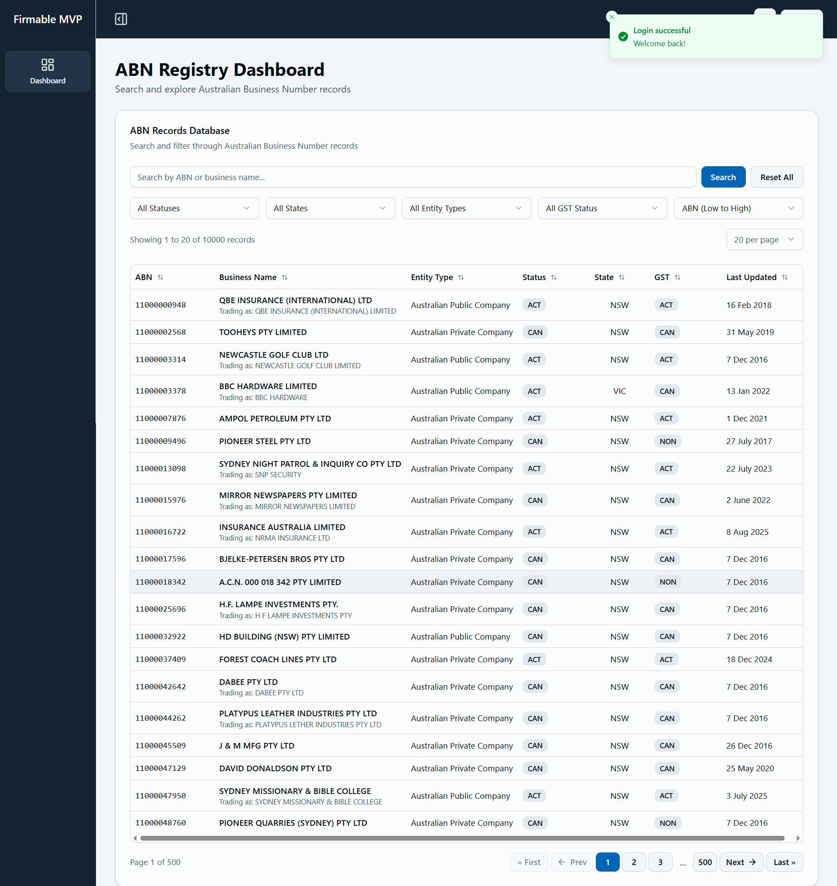
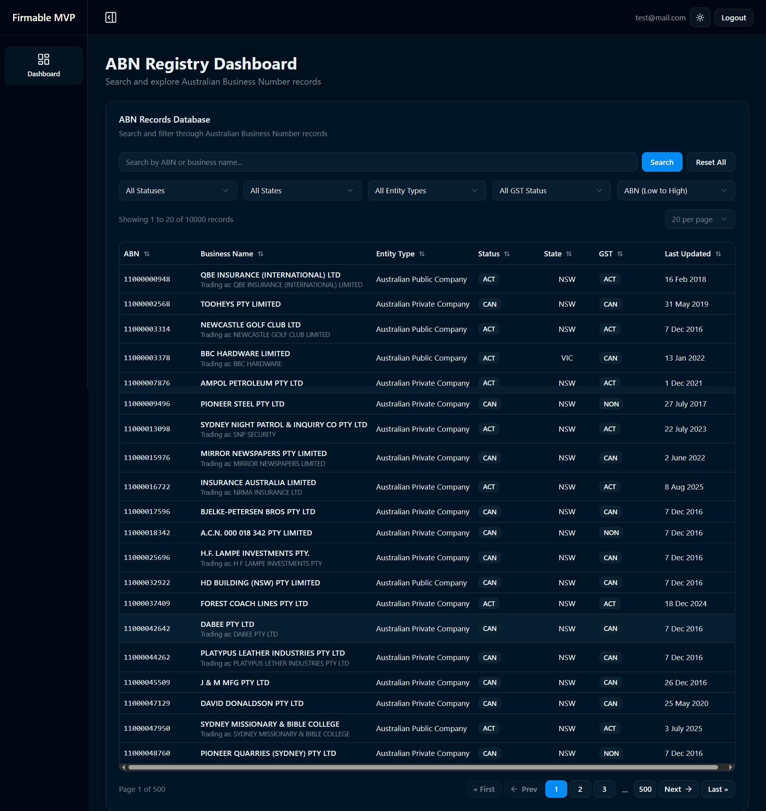
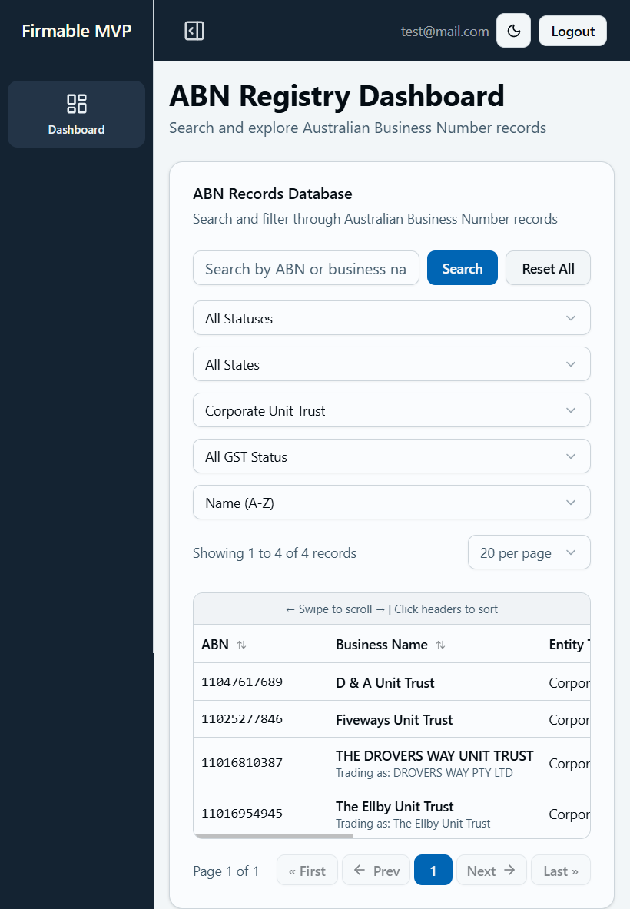
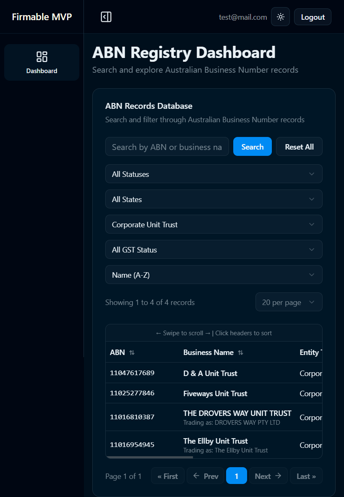

<h1 align="center">Firmable MVP: ABN Registry Dashboard</h1>

<p align="center">
  <strong>A modern full-stack application to search and explore Australian Business Number records</strong>
</p>

<br />

<p align="center">
    
    
    
    
</p>

<p align="center">
    
    
    
    
</p>

<p align="center">
    
    
    
    
</p>

<br />

<br />

## 🎨 Screenshots (Desktop and Mobile View)

## **Login Page**



### **Mobile View**



</div>

<br />

## **Register Page**



### **Mobile View**



</div>

<br />

## **Dashboard Page**

### **Light Mode**



### **Dark Mode**



### **Mobile View**





</div>

<br />

## 🚀 Features

- **🔐 User Authentication** - Secure JWT-based login/register with refresh tokens
- **🔍 Advanced Search** - Search by ABN, business name, or entity details
- **📊 Multi-Filter Support** - Filter by status, state, entity type, GST status, postcode
- **📄 Pagination** - Adjustable page sizes (10, 20, 50, 100 records per page)
- **↕️ Flexible Sorting** - Sort by name, ABN, or last updated date
- **🌓 Dark/Light Mode** - Theme switching with persistent preferences
- **📱 Responsive Design** - Mobile-optimized interface with touch gestures
- **⚡ XML Data Ingestion** - Bulk import ABN records from official XML datasets

<br />

## 🛠️ Tech Stack

**Frontend:** React, TypeScript, Vite, Tailwind CSS, Radix UI, shadcn/ui, React Router, Zustand

**Backend:** Node.js, Express.js, TypeScript, MongoDB, Mongoose, JWT, Bcrypt

**Data Processing:** XML Parser, MongoDB Pagination Plugin

<br />

## 📁 Project Structure

```
firmable-mvp/
├── client/                    # React Frontend
│   ├── src/
│   │   ├── components/
│   │   │   ├── abn/           # ABN table components
│   │   │   ├── ui/            # shadcn/ui components
│   │   │   ├── AbnRecordsTable.tsx
│   │   │   ├── LoginForm.tsx
│   │   │   ├── RegisterForm.tsx
│   │   │   └── AppSidebar.tsx
│   │   ├── pages/
│   │   │   ├── DashboardPage.tsx
│   │   │   ├── LoginPage.tsx
│   │   │   └── RegisterPage.tsx
│   │   ├── layouts/
│   │   │   ├── AuthLayout.tsx
│   │   │   └── NonAuthLayout.tsx
│   │   ├── hooks/
│   │   │   ├── useAbnRecords.ts
│   │   │   └── useClientSort.ts
│   │   ├── store/
│   │   │   └── authStore.ts   # Zustand state management
│   │   ├── http/
│   │   │   └── api.ts         # API client
│   │   └── types/
│   │       └── abnRecord.types.ts
│   └── package.json
├── server/                    # Express.js Backend
│   ├── src/
│   │   ├── controllers/
│   │   │   ├── abn/abnController.ts
│   │   │   └── user/userController.ts
│   │   ├── models/
│   │   │   ├── abn/abnModel.ts
│   │   │   └── user/userModel.ts
│   │   ├── routes/
│   │   │   ├── abn/abnRoutes.ts
│   │   │   └── user/userRoutes.ts
│   │   ├── scripts/
│   │   │   └── data-ingestion/
│   │   │       ├── dataIngestionToDB.ts
│   │   │       ├── readers/xmlReader.ts
│   │   │       └── services/recordImporter.ts
│   │   ├── config/
│   │   │   ├── config.ts
│   │   │   ├── db.ts
│   │   │   └── logger.ts
│   │   └── middlewares/
│   │       └── globalErrorHandler.ts
│   ├── assets/public/         # XML data files
│   └── server.ts
└── README.md
```

<br />

## 🚀 Getting Started

**Prerequisites:** Node.js v18+, MongoDB, npm/yarn

### Installation

```bash
# Clone repository
git clone https://github.com/prateek-bka/firmable-mvp
cd firmable-mvp

# Setup Backend (Terminal 1)
cd server
npm install
cp .env.sample .env  # Configure environment variables
npm run dev          # Server: http://localhost:5000

# Setup Frontend (Terminal 2)
cd client
npm install
cp .env.sample .env  # Configure API URL
npm run dev          # Frontend: http://localhost:5173
```

### 🛠️ Available Scripts

```bash
# Frontend
npm run dev      # Development server

# Backend
npm run dev      # Development with nodemon
npm run import:dbdata # Data Ingestion to Database
```

<br />

## 🔧 Configuration

### Backend (.env)

```env
PORT=5000
NODE_ENV=development
MONGODB_URI=mongodb://localhost:27017/firmable
JWT_SECRET=your_jwt_secret_key
JWT_REFRESH_SECRET=your_jwt_refresh_secret
FRONTEND_URL=http://localhost:5173
```

### Frontend (.env)

```env
VITE_API_BASE_URL=http://localhost:5000
```

<br />

## 📊 Data Ingestion

Import ABN records from XML files:

```bash
cd server
npm run import:dbdata
```

Place XML files in `server/assets/public/` directory. The script processes bulk ABN datasets and imports them into MongoDB.

<br />

## 📡 API Documentation

**Base URL:** `https://firmable.prateekcodes.xyz/api`

### 🔐 Authentication Endpoints

#### Register User

```http
POST /auth/register
Content-Type: application/json

{
  "email": "test@mail.com",
  "password": "testUser2$"
}
```

#### Login

```http
POST /auth/login
Content-Type: application/json

{
  "email": "test@mail.com",
  "password": "testUser2$"
}
```

#### Refresh Token

```http
POST /auth/refresh
```

#### Logout

```http
POST /auth/logout
```

### 📊 ABN Records Endpoints

#### Get Filter Options

```http
GET /abn/get-all-filter-options?counts=true
```

**Response:**

```json
{
  "success": true,
  "data": {
    "states": ["NSW", "VIC", "QLD", "SA", "WA", "TAS", "NT", "ACT"],
    "statuses": ["ACT", "CAN"],
    "entityTypes": [
      { "code": "IND", "text": "Individual/Sole Trader" },
      { "code": "PRV", "text": "Private Company" }
    ],
    "gstStatuses": ["Registered", "Not registered"],
    "postcodes": ["2000", "3000", ...],
    "sortOptions": [...]
  }
}
```

#### Search ABN Records

```http
GET /abn/search?q=insurance&status=ACT&state=NSW&sort=name_asc&page=1&limit=20
```

**Query Parameters:**

- `q` - Search term (ABN or business name)
- `status` - ABN status (ACT/CAN)
- `state` - State code (NSW, VIC, etc.)
- `entityType` - Entity type code
- `gst` - GST registration status
- `postcode` - Postcode
- `sort` - Sort option (name_asc, abn_desc, updated_desc, etc.)
- `page` - Page number (default: 1)
- `limit` - Records per page (default: 20, max: 100)

**Response:**

```json
{
  "success": true,
  "message": "Found 150 matching record(s)",
  "data": {
    "businesses": [...],
    "pagination": {
      "page": 1,
      "limit": 20,
      "total": 150,
      "pages": 8,
      "hasNext": true,
      "hasPrev": false
    }
  }
}
```

#### Get All Records (Paginated)

```http
GET /abn?page=1&limit=20
```

#### Get Single Business by ABN

```http
GET /abn/:abn
```

### 🚨 Error Response Format

```json
{
  "success": false,
  "error": {
    "code": "FETCH_ERROR",
    "message": "Error description"
  }
}
```

<br />

## 🏗️ Architecture

**Frontend:** Component-based React with TypeScript, custom hooks for data fetching, Zustand for auth state management

**Backend:** RESTful API with Express.js, MongoDB with pagination, JWT authentication with refresh tokens

**Security:** HTTP-only cookies, bcrypt password hashing, input validation

<br />

## 🧪 Testing

**Manual Testing:**

- User registration and login flows
- ABN record search and filtering
- Pagination and sorting functionality
- Responsive design across devices
- Dark/light theme switching

<br />

## 🚀 Future Enhancements

- **🔍 Advanced Analytics** - Business insights and trends visualization
- **📊 Data Export** - CSV/Excel export functionality
- **🔔 Real-time Notifications** - Alert system for record updates
- **📈 Dashboard Charts** - Visual analytics for ABN statistics
- **🔐 Role-based Access Control** - Multi-level user permissions
- **🧪 Automated Testing** - Unit, integration, and E2E tests
- **📊 Monitoring** - APM and infrastructure monitoring (SigNoz, Wazuh)
- **🔐 Secrets Management** - HashiCorp Vault integration

<br />

<h3 align="center"><b>👨‍💻 Prateek Agrawal</b></h3>
<p align="center">
<a href="https://linkedin.com/in/prateek-bka">
    
</a>
<a href="https://github.com/prateek-bka">
    
</a>
<a href="mailto:prateek.bka@gmail.com">
    
</a>
</p>

<br />

<p>
  <strong>Built with ❤️ using React, Express.js, and modern web technologies</strong>
</p>

<p>
  Give a ⭐️ if you like this project!
</p>
